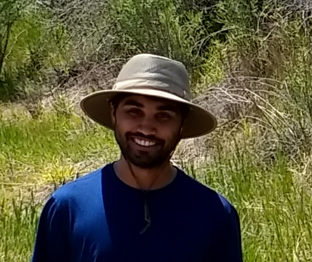

### who are you?

I am a PhD candidate in the
[Department of Economics](https://www.colorado.edu/Economics/)
at the University of Colorado&ndash;Boulder. My research is in
in environmental, natural resource, and computational economics.

I received a BS in [Business Administration](https://soba.ucr.edu/)
in 2012 from the
University of California&ndash;Riverside, and an
MA in [Economics](https://www.colorado.edu/Economics/) in 2016 from the
University of Colorado&ndash;Boulder; my PhD advisor is
[Dan Kaffine](http://spot.colorado.edu/~daka9342/).

### what do you do?

For the last few years, I've studied common-pool resources and commercial orbit use. Earth's orbits are the world's largest common-pool resource. As humans launches more satellites, the risk of collisions between orbiting objects increases. Paths in low-Earth orbit are under &ldquo;open access&rdquo; - though radio spectrum in those regions is licensed, firms are unable to secure property rights over orbital locations. Open access to a commons typically results in over-exploitation, and sometimes collapse, of the resource. In the orbital case, expect to see more catastrophic collisions and a higher risk of [Kessler Syndrome](https://en.wikipedia.org/wiki/Kessler_syndrome) in low-Earth orbit than would be socially optimal.

Day to day, I write theoretical economic models and prove that they possess certain properties or compute them. Sometimes both. Sometimes I use data to compute things, with or without a theoretical model. My favorite computations tell a story and lend themselves to cool pictures. In my free time, I create [ridiculous Twitter bots](https://twitter.com/bakRabot), play video games (usually online RTS games and single-player RPGs), and think about the economics of fictional worlds.

[curriculum vitae ]({{ BASE_PATH }}/assets/rao_cv.pdf) 
<!-- [orcid](https://orcid.org): [0000-0002-4914-6671](https://orcid.org/0000-0002-4914-6671) 
[google scholar](https://scholar.google.com/citations?sortby=pubdate&hl=en&user=42tCp5UAAAAJ&view_op=list_works) 
[impactstory](https://impactstory.org/u/0000-0002-4914-6671) -->

---

<h4>contact</h4>

    

        

            Akhil Rao 
            <a href="https://www.colorado.edu/Economics/">Department of Economics</a> 
            <a href="https://www.colorado.edu">University of Colorado&ndash;Boulder</a> 
            <a href="https://map.wisc.edu/s/2tie3nen">256 UCB</a> 
            Econ 414 
            Boulder, Colorado 80309&ndash;0256 
            USA  

            

            Email: <code>akh</code><b>I</b><code>il.rao</code><b>don't</b><code>@</code><b>want</b><code>co</code><b>spam!
            </b><code>lo</code><b>So</b><code></code><b>please</b><code>ra</code><b>leave
            </b><code>do</code><b>me</b><code>.</code><b>alone</b><code>e</code><b>!</b><code>du</code> 
            Phone: 951-732-7261
            

        

        

        
        

    

