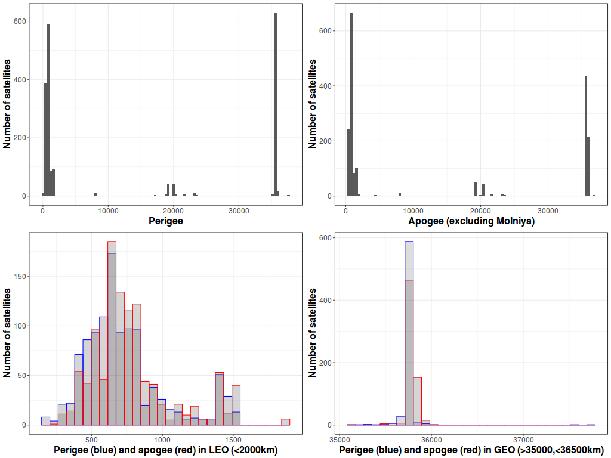

<!-- 

  

      <ul class="nav">
          <li><a href="interfer_fig1.html">prev</a></li>
          <li><a href="mousebc_fig3.html">next</a></li>
      </ul>
  

 -->

**Figure 1**. &mdash; The distribution of apogee and perigee of orbiting satellites. Space is big, but some locations are more valuable than others.