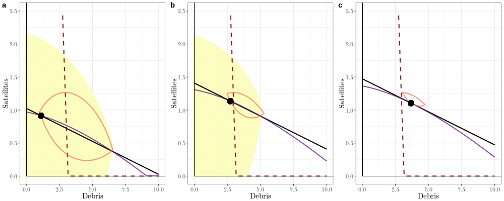

  

      <ul class="nav">
          <li><a href="yearly_hhi_leo_gso.html">prev</a></li>
          <li><a href="value_diff_1.html">next</a></li>
      </ul>
  

**Will open access be more or less likely to cause Kessler Syndrome as satellites become more profitable?** &mdash; Under open access, aggregate orbital stocks will tend toward a steady state where satellite and debris stocks are stable over time. What will happen to the steady state as satellites become more profitable?

The shaded yellow region shows the basin of attraction of the stable open-access steady state, and the dashed red line shows the boundary where the fragment autocatalysis rate (the rate at which new fragments are created, net of decay) become positive. The solid black line shows the equilibrium isoquant (where the marginal private benefits of satellite ownership equal the marginal private costs), and the purple and pink lines show the satellite and debris nullclines. The black dot shows the stable (in panels a and b) or only (in panel c) open-access steady state. From panel a to c the rate of excess return steadily increases, shrinking the basin of attraction of the stable open-access steady state or equivalently increasing the size of the Kessler region. When the stable open-access steady state crosses the fragment autocatalysis rate boundary, it loses stability and its basin of attraction vanishes.

The basin of attraction was calculated by simulating the system forward under open access, with each point on a fine grid as a different initial condition. Initial conditions which converged to the stable steady state were marked as in the basin. Those where the debris stock diverged to infinity were marked as outside the basin.

Image from [Rao and Rondina (2019)](../../assets/working_papers/Cost_in_Space.pdf).