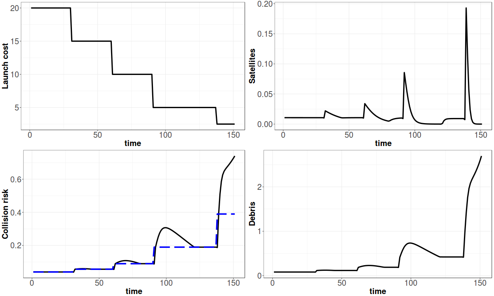

<!-- 

  

      <ul class="nav">
          <li><a href="rqtlexper_fig1.html">prev</a></li>
          <li><a href="phyloqtl_fig6.html">next</a></li>
      </ul>
  

 -->

**Figure 2**. &mdash; The effects of falling launch costs under open access to orbit. Equilibrium collision risk (blue dashed line) rises with the rate of excess return, and debris levels increase.
