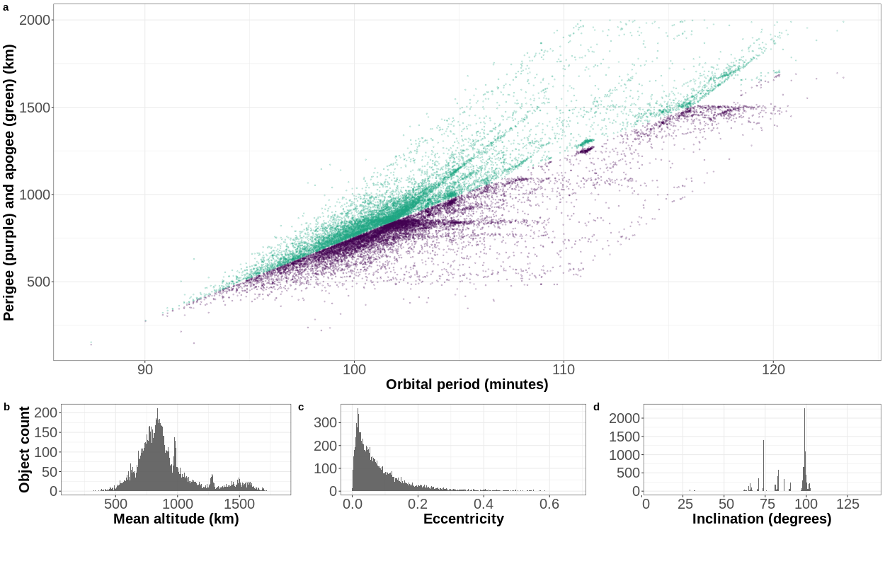




  

      <ul class="nav">
          
          
          <li><a href="{{ current_viz.prev }}.html">← prev</a></li>
          
          <li><a href="../../pages/visualizations.html">all visualizations</a></li>
          
          
          <li><a href="{{ current_viz.next }}.html">next →</a></li>
          
      </ul>
  

**Where are debris located?** &mdash; The figure shows the locations of debris in low-Earth orbit. Panel a shows the [apogee and perigee](https://en.wikipedia.org/wiki/Apsis) against the [orbital period](https://en.wikipedia.org/wiki/Orbital_period) for all tracked debris orbiting the Earth, using [July 07 2018 data from the Joint Space Operations Center](https://www.space-track.org). Panels b, c, and d show histograms of debris over mean altitude, eccentricity, and inclination. The majority of debris are clustered at around 800 km mean altitude and 100 degree inclinations, with mostly-circular orbits.

The plot shown in panel a is a "Gabbard diagram", which are used to visualize the distribution of debris after fragmentation events (e.g. [1](https://en.wikipedia.org/wiki/Space_debris#/media/File:Gabbard_diagram.png), [2](https://www.orbitaldebris.jsc.nasa.gov/library/satellitefraghistory/13theditionofbreakupbook.pdf)). Clusters of points indicate objects with similar altitudes and velocities around the Earth.
