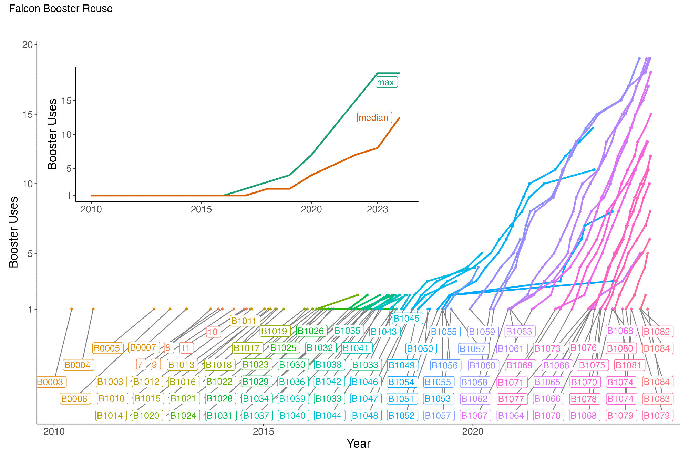

  

      <ul class="nav">
          <li><a href="launch_summary.html">prev</a></li>
          <li><a href="yearly_sat_hhi_leo.html">next</a></li>
      </ul>
  

 

**How many times has SpaceX reused Falcon boosters?** &mdash; The picture plots the number of times each Falcon booster has flown, whether on a Falcon 9 (solo) or a Falcon Heavy (as one of three), using [2023 data from Jonathan McDowell's General Catalog of Artificial Space Objects](https://planet4589.org/space/gcat/). By late 2023, 4 boosters had flown 19 times and the median booster had flown 12 times.