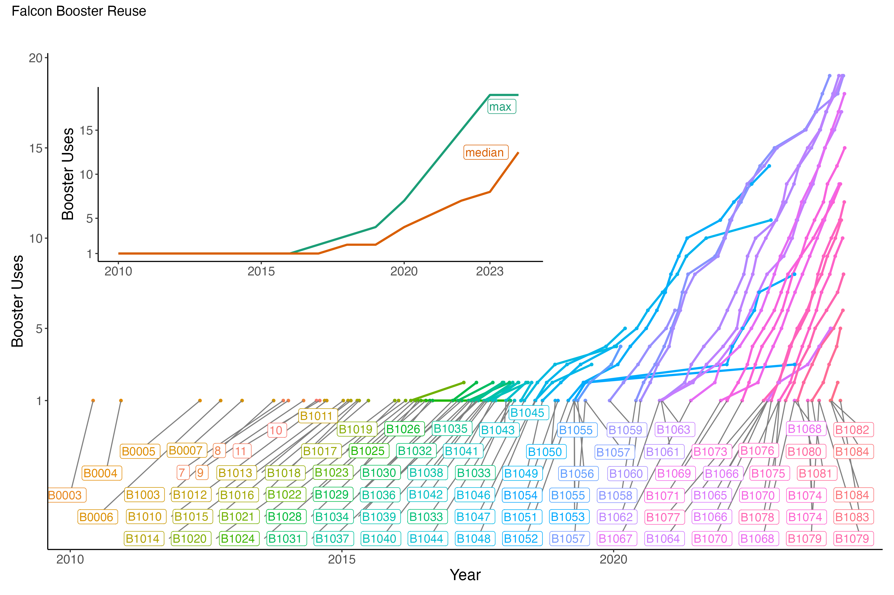




  

      <ul class="nav">
          
          
          <li><a href="{{ current_viz.prev }}.html">← prev</a></li>
          
          <li><a href="../../pages/visualizations.html">all visualizations</a></li>
          
          
          <li><a href="{{ current_viz.next }}.html">next →</a></li>
          
      </ul>
  

**How many times has SpaceX reused Falcon boosters?** &mdash; The picture plots the number of times each Falcon booster has flown, whether on a Falcon 9 (solo) or a Falcon Heavy (as one of three), using [2023 data from Jonathan McDowell's General Catalog of Artificial Space Objects](https://planet4589.org/space/gcat/). By late 2023, 4 boosters had flown 19 times and the median booster had flown 12 times.