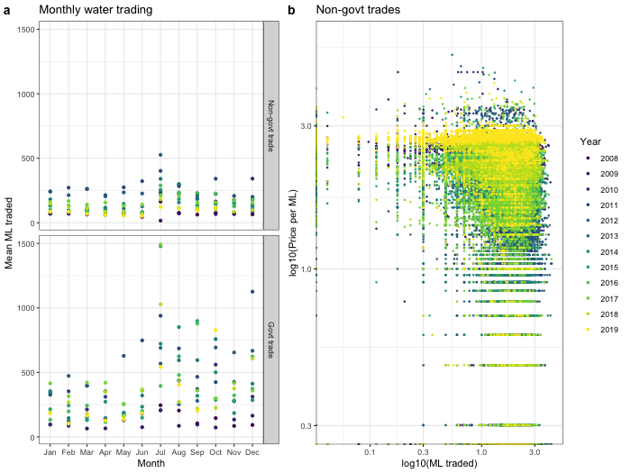

  

      <ul class="nav">
          <li><a href="trading_over_time.html">prev</a></li>
          <li><a href="trading_over_time.html">next</a></li>
      </ul>
  

 

**How does allocation trading vary by trading entity type?** &mdash; The figure shows [water allocation trading](http://www.bom.gov.au/water/market/about.shtml) in Australia from 2008 to 2019. Panel a shows the average number of megaliters traded every month of the year over the sample period, split by whether the trade was conducted by a governmental entity (typically recorded with zero price) or a private entity (typically recorded with a positive price). Governmental trades are generally to maintain hydrological stability, and are both more variable than private trading and higher volume in the latter half of the year.

Panel b shows allocation trades in price-quantity space (both in log base 10). The plot is consistent with water supply curve shifting more year-to-year than the water demand curve. Later years seem to see slightly less price variability than earlier years.

The data were downloaded from the Bureau of Meteorology's [water information dashboard](http://www.bom.gov.au/water/dashboards/#/water-markets/national/state/at).
