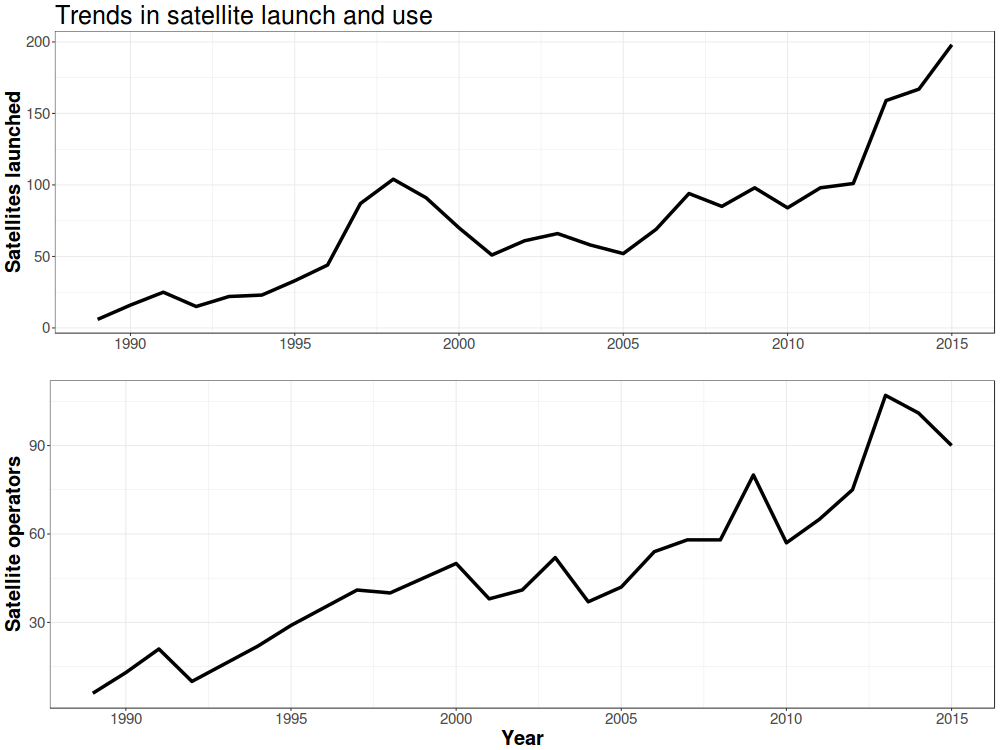




  

      <ul class="nav">
          
          
          <li><a href="{{ current_viz.prev }}.html">← prev</a></li>
          
          <li><a href="../../pages/visualizations.html">all visualizations</a></li>
          
          
          <li><a href="{{ current_viz.next }}.html">next →</a></li>
          
      </ul>
  

**How have satellite launches and use been trending?**. &mdash; Since 1990, the number of satellites launched per year has increased dramatically. For most of this period, this growth was accompanied by growth in the number of different satellite operators. Most operators owned a handful of satellites, mostly in the geosynchronous belt. the late 1990s marked the rise of Iridium, the first large low-Earth orbit constellation. Part of the New Space era is the rise of new mega-constellations in low-Earth orbit. I used [data from the Union of Concerned Scientists](https://www.ucsusa.org/nuclear-weapons/space-weapons/satellite-database) to generate these plots.
