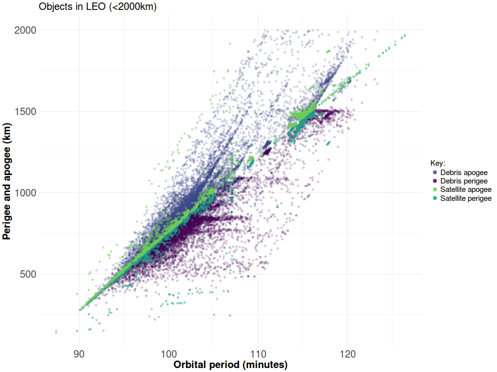

  

      <ul class="nav">
          <li><a href="leo_geo_gabbard.html">prev</a></li>
          <li><a href="launch_summary.html">next</a></li>
      </ul>
  

 

**Where are active satellites located?** &mdash; The picture plots the [apogee and perigee](https://en.wikipedia.org/wiki/Apsis) against the [orbital period](https://en.wikipedia.org/wiki/Orbital_period) for all tracked objects in the  orbiting the Earth, using [data from the Joint Space Operations Center](https://www.space-track.org). These types of plots, called ``Gabbard diagrams'', are used to visualize the distribution of debris after fragmentation events (e.g. [1](https://en.wikipedia.org/wiki/Space_debris#/media/File:Gabbard_diagram.png), [2](https://www.orbitaldebris.jsc.nasa.gov/library/satellitefraghistory/13theditionofbreakupbook.pdf)). Clusters of points indicate objects with similar altitudes and velocities around the Earth.