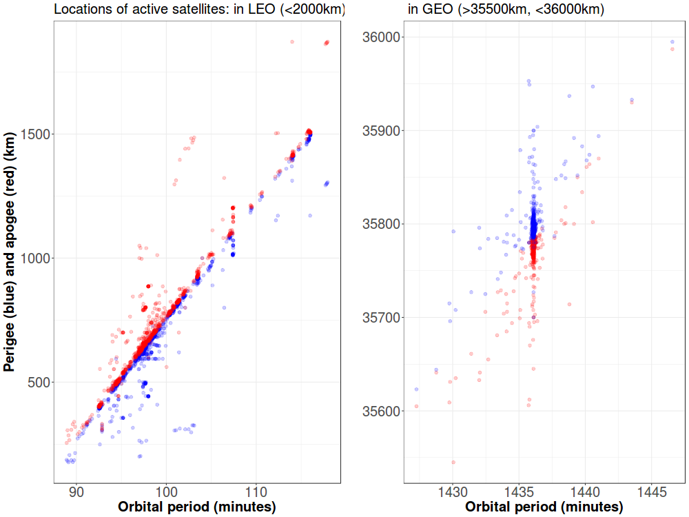

  

      <ul class="nav">
          <li><a href="apo_peri_overlay.html">prev</a></li>
          <li><a href="launch_summary.html">next</a></li>
      </ul>
  

 

**Where are active satellites located?** &mdash; The picture plots the [apogee and perigee](https://en.wikipedia.org/wiki/Apsis) against the [orbital period](https://en.wikipedia.org/wiki/Orbital_period) for active satellites orbiting the Earth, calculated using [data from the Union of Concerned Scientists](https://www.ucsusa.org/nuclear-weapons/space-weapons/satellite-database).

These types of plots, called ``Gabbard diagrams'', are used to visualize the distribution of debris after fragmentation events (e.g. [1](https://en.wikipedia.org/wiki/Space_debris#/media/File:Gabbard_diagram.png), [2](https://www.orbitaldebris.jsc.nasa.gov/library/satellitefraghistory/13theditionofbreakupbook.pdf)). Clustering in the diagram indicates that multiple objects have similar orbits.

The clustering in the Gabbard diagram on the right occurs at a period of around 1435 minutes, or approximately 24 hours - the (geosynchronous belt)[https://en.wikipedia.org/wiki/Geosynchronous_orbit]. The clustering on the Gabbard diagram on the left occurs all throughout LEO. Objects in LEO tend to have higher relative velocities with respect to each other. This makes clustering in this regime potentially more dangerous than in GEO, where objects move relatively slowly with respect to each other. Additionally, GEO slots are auctioned by the ITU, creating incentives to use the resource efficiently. On the other hand, LEO is under open access, which creates incentives to rush to fill spaces and ignore external effects.