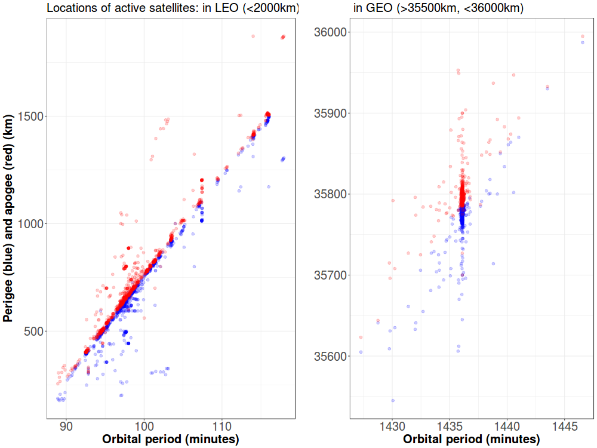

  

      <ul class="nav">
          <li><a href="apo_peri_overlay.md">prev</a></li>
          <li><a href="leo_gabbard_all.md">next</a></li>
      </ul>
  

 

**Where are active satellites located?** &mdash; The picture plots the [apogee and perigee](https://en.wikipedia.org/wiki/Apsis) against the [orbital period](https://en.wikipedia.org/wiki/Orbital_period) for active satellites orbiting the Earth, calculated using [2016 data from the Union of Concerned Scientists](https://www.ucsusa.org/nuclear-weapons/space-weapons/satellite-database). 

These types of plots, called "Gabbard diagrams", are used to visualize the distribution of debris after fragmentation events (e.g. [1](https://en.wikipedia.org/wiki/Space_debris#/media/File:Gabbard_diagram.png), [2](https://www.orbitaldebris.jsc.nasa.gov/library/satellitefraghistory/13theditionofbreakupbook.pdf)). Clusters of points indicate objects with similar altitudes and velocities around the Earth.

The clustering on the diagram on the left occurs throughout LEO, but mostly below 1000 km. The clustering in the diagram on the right occurs at a period of around 1435 minutes, or approximately 24 hours - the [geosynchronous belt](https://en.wikipedia.org/wiki/Geosynchronous_orbit).