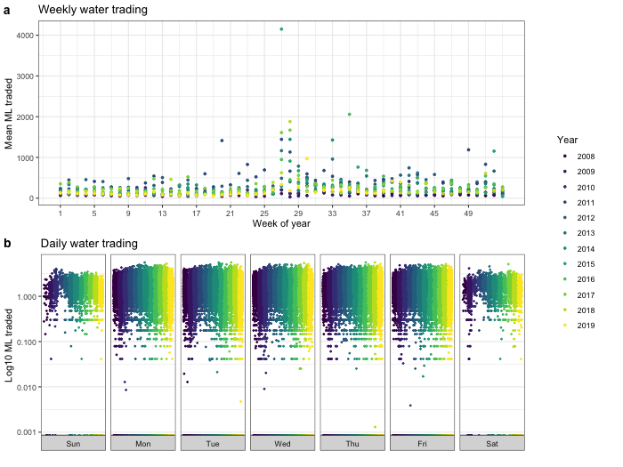

  

      <ul class="nav">
          <li><a href="apo_peri_overlay.html">prev</a></li>
          <li><a href="govt_vs_nongovt_trades.html">next</a></li>
      </ul>
  

 

**When is the Australian water allocation market most liquid?** &mdash; The figure shows [water allocation trading](http://www.bom.gov.au/water/market/about.shtml) in Australia from 2008 to 2019. Panel a shows the average number of megaliters (ML, 1 ML = 1 million liters) traded every week of the year over the sample period. Most trades occur in the latter (drier) half of the year.

Panel b shows the trading volume over time on different days of the week, in log base 10 since there's a lot of variation in quantities traded. Most trades seem to occur between Monday and Friday. In this view, it's easier to see that 2011 and 2012 had relatively little variation in quantities traded.

The data were downloaded from the Bureau of Meteorology's [water information dashboard](http://www.bom.gov.au/water/dashboards/#/water-markets/national/state/at).
