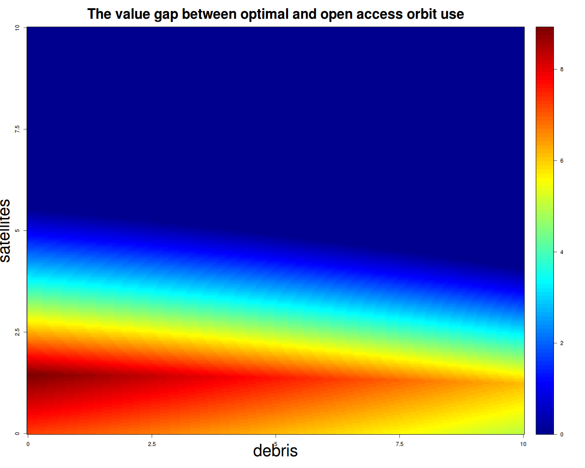

  

      <ul class="nav">
          <li><a href="biffplot3.html">prev</a></li>
          <li><a href="apo_peri_overlay.html">next</a></li>
      </ul>
  

**What do society's gains from constrained-optimal low-Earth orbit use look like?** &mdash; Projected gains from constrained-optimal management via orbital-use fees (OUFs). This is "constrained" optimal because it involves levying a single undifferentiated OUF on all of LEO, rather than a fee that varies by orbit and satellite characteristics. Even a constrained-optimal OUF would represent a substantial improvement over the open-access status quo.

Panel a shows the NPV of orbit recovery with constrained-optimal management beginning in different years. The business-as-usual (BAU) open-access path is shown in black. The NPV gain is the difference between constrained-optimal management and BAU.  Panel b shows the loss in permanent orbit-use value (lost fleet NPV) from delaying optimal management, relative to 2020 optimal management start. Panel c shows the time path of the constrained-optimal OUF. Since this path was estimated using data based on the "old" model of satellite use&mdash;a few big expensive assets, rather than the "new" model of swarms of cheap satellites&mdash;the level of the path is likely too high for mega-constellations, though the increasing trend will likely still apply. This increasing trend reflects the restored rents to orbit use due to lower collision risk under an OUF regime. Panel d shows distribution of the ratio of optimal NPV in 2040 (assuming optimal management begins in 2020) to BAU NPV in 2040 using 250 draws of alternate parameter sets. The distribution is calculated via a residual-bootstrap resampling procedure which illustrates the effect of calibration uncertainty.

Image source: Rao et al. (2020) (revisions requested, PNAS; mimeo)
