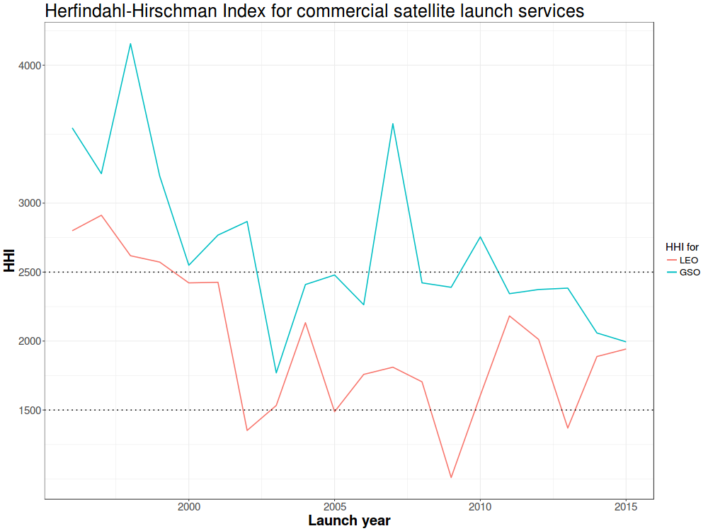

  

      <ul class="nav">
          <li><a href="apo_peri_overlay.html">prev</a></li>
          <li><a href="biffplot3.html">next</a></li>
      </ul>
  

**How competitive is the satellite launch industry in the New Space era?**. &mdash; The [Herfindahl-Hirschman Index](https://en.wikipedia.org/wiki/Herfindahl_index) measures market concentration. The US Department of Justice generally considers a market with an HHI between 1500 and 2500 points as "moderately concentrated'', and one with an HHI above 2500 points as "highly concentrated" ([source](https://www.justice.gov/atr/herfindahl-hirschman-index)). By this measure, the New Space era is marked by an increase in competition between launch providers, though launch providers still retain some market power.

I used [data from the Union of Concerned Scientists](https://www.ucsusa.org/nuclear-weapons/space-weapons/satellite-database) to calculate the number of unique commercial launch providers worldwide ever year. Yearly market shares were calculated using the number of satellites launched by a single provider relative to the total number launched that year. To the extent that some commercial satellite operators are constrained in their choice of launch providers by regulations (e.g., US operators may be barred from using non-US launch providers due to [ITAR](https://en.wikipedia.org/wiki/International_Traffic_in_Arms_Regulations)), this calculation is biased toward zero. I don't account for joint ownership between rocket providers, with the exception of [ULA](https://en.wikipedia.org/wiki/United_Launch_Alliance), which also biases the calculations toward zero. Taken together, this calculation should be interpreted as a lower bound on launch market concentration, or an upper bound on launch market competitiveness.
