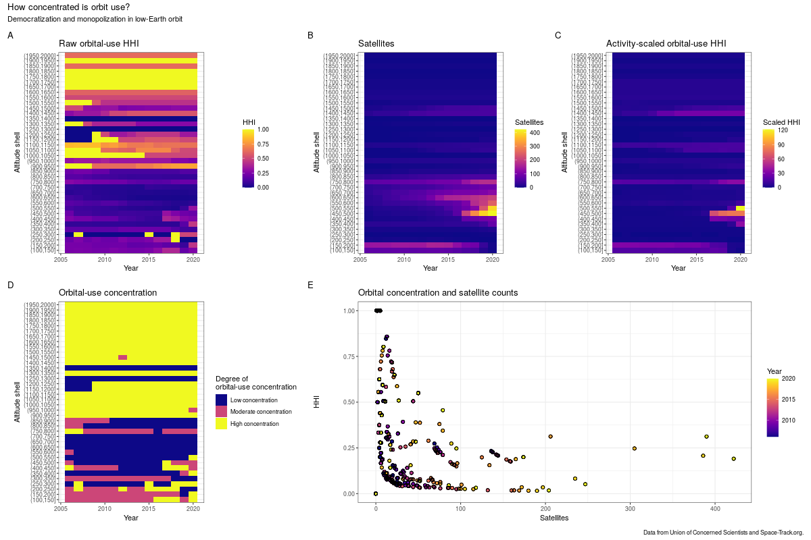

  

      <ul class="nav">
          <li><a href="yearly_sat_hhi_leo.html">prev</a></li>
          <li><a href="leo_gabbard_all">next</a></li>
      </ul>
  

**How concentrated is orbit use and satellite ownership?** &mdash; The [Herfindahl-Hirschman Index](https://en.wikipedia.org/wiki/Herfindahl_index) measures market concentration. The US Department of Justice generally considers a market with an HHI between 1500 and 2500 points as "moderately concentrated'', and one with an HHI above 2500 points as "highly concentrated" ([source](https://www.justice.gov/atr/herfindahl-hirschman-index)). By this measure alone, many regions of low-Earth orbit (LEO) are highly concentrated.

But this measure alone may be misleading. Some regions are used by only a few operators because only a few operators find them useful. This is the case in the higher reaches of LEO, e.g. the 1700-1750km shell.

I used [data from the Union of Concerned Scientists](https://www.ucsusa.org/nuclear-weapons/space-weapons/satellite-database) and Space-Track.org to calculate the annual numbers of unique satellite operators and the active satellites they control in 50km spherical shells in LEO. I calculated yearly "market shares" using the number of satellites owned by a single operator relative to the total number of active satellites that year. Panel A shows these "raw" HHI values, while panel D shows the Department of Justice's classification. 

Panel B shows the number of satellites in orbit in each year. From it, we can see that the 400-800km region is where most of the action is. Panel E shows how the number of satellites in a shell correlates with HHI over time. The negative correlation indicates that new satellites have typically come from new operators. This has started to change a bit in recent years, as seen in some of the more-recent points having both higher satellite counts and higher HHIs.

But the real story is in panel C. This shows HHI scaled by the number of satellites in that shell. So a shell with high concentration and few satellites will have a low "activity-scaled HHI", reflecting that it's concentrated but not very useful to many operators, while a shell with high concentration and many satellites will have a high "activity-scaled HHI", reflecting that it's both concentrated and a region with high activity. While the absolute levels aren't as interpretable as the components they're derived from, the relative levels show very clearly the rise of Starlink in the 500-550km shell (where the majority of satellites are part of the Starlink constellation).

Taken together these paint a picture of LEO as a large area where activity is concentrated in a few places and, increasingly, a few operators own the majority of active satellites.
